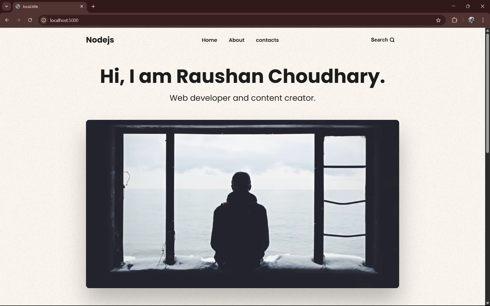
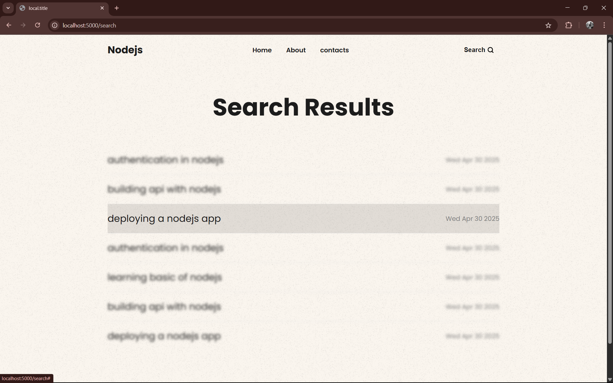
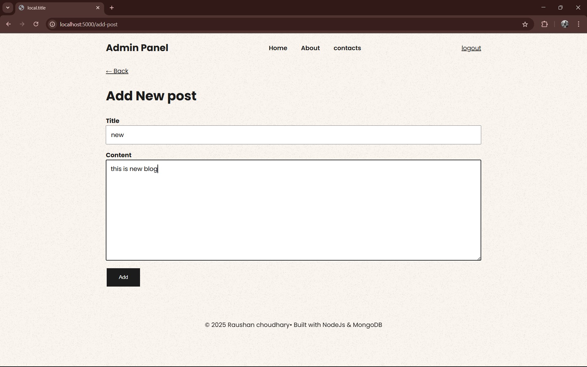
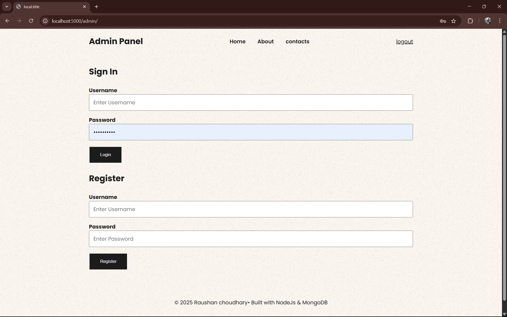
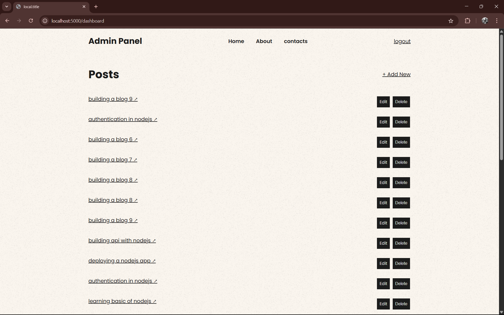

 Node.js Blog Application
This is a full-featured blog application built using Node.js, HTML, CSS, and JavaScript. The application includes user authentication, allowing users to sign up, log in, and log out securely.

 Features:
 User Authentication – Secure sign-up, login, and logout functionality.

 Post Management – Authenticated users can create, edit, and delete their blog posts.

 Search & Filter – Users can easily search and filter blog posts based on keywords or categories for a better browsing experience.

 Tech Stack:
Frontend:

HTML

CSS

JavaScript

Backend:

Node.js

Express.js

Database:

MongoDB

Authentication:

JSON Web Tokens (JWT)
 How to Run Locally
Clone the repository

Install dependencies
 git clone https://github.com/raushan587/Nodejs--blog.git

 cd Nodejs--blog

npm install 

.env (Add this to your project root)

# MongoDB Connection String
MONGO_URI=mongodb://localhost:27017/nodejsdb

# JWT Secret Key 
JWT_SECRET=your_secret_key_here

# Port for your application to run on
PORT=5000
npm start
##  Screenshots

